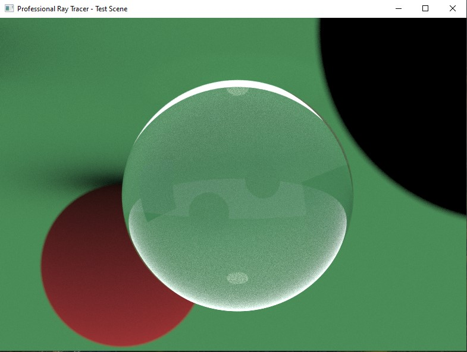
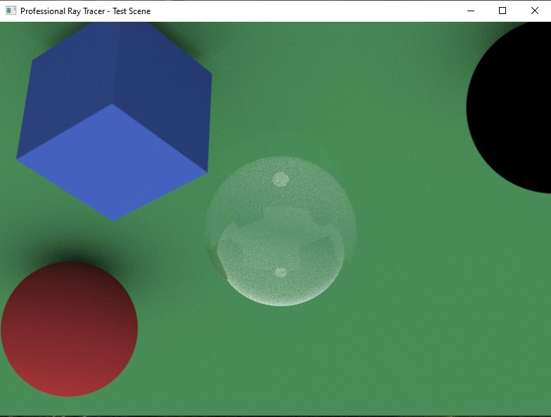

# Ray Engine

A high-performance, physically-based ray tracer built from scratch in pure C++17. Features path tracing, advanced materials, and Windows display output. The rendering isn't real-time to save memory. When you compile the code and execute it, it will be seen that nothing happened but waiting some time around 40s (40s on our AMD Phenom™ 8750B Triple-Core Processor but on any modern hardware, expect several seconds not 40 or 50), the output will be shown in default Windows window. This is the first version of Ray Engine. Everything was done on the same PC.

## Rendered Examples

Here are some images rendered with Ray-Engine:





## 🚀 Features

- **Pure C++17** - No external dependencies, only standard libraries
- **Physically Based Rendering** - Lambertian diffuse, metal, dielectric materials with Fresnel reflectance
- **Path Tracing** - Advanced light transport simulation with importance sampling
- **Multi-threaded Rendering** - Utilizes all CPU cores for maximum performance
- **Real-time Display** - Native Windows API integration for immediate preview
- **Advanced Materials**:
  - Lambertian diffuse surfaces
  - Metallic materials with configurable roughness
  - Glass/dielectric with realistic refraction
  - Emissive light sources
- **Geometric Primitives**: Spheres, triangles, cubes with bounding volume acceleration
- **Camera System** - Configurable FOV, depth of field, and positioning

## 🎯 Performance

Rendered at **800x600** resolution with **200 samples per pixel** in ~40 seconds on:
- **CPU**: AMD Phenom™ Triple-Core 2.40 GHz
- **RAM**: 2GB DDR2 (564MB available)
- **Storage**: 149GB HDD
- **Memory Usage**: 11.4-11.8 MB
- **CPU Usage**: 100% (all 3 cores utilized)
- **Disk Usage**: 0%

## 🛠️ Build Instructions

### Requirements
- C++17 compatible compiler (tested with x86_64-15.1.0-release-mcf-seh-ucrt-rt_v12-rev0_1)
- Windows (for display functionality)

### Compilation
```bash
# With maximum optimization
g++ -std=c++17 -O3 -m64 -flto -pthread -mwindows -static-libgcc -static-libstdc++ -o ray_engine rayengine.cpp -lgdi32 -luser32
```

## 🎮 Usage

Simply run the executable:
```bash
./ray_engine.exe
```

The program will:
1. Initialize the ray tracer with a test scene
2. Render using all available CPU cores (max 3)
3. Show the result in a Windows GUI window
4. Press **ESC** or close window to exit

## 🎨 Scene Configuration

The default test scene includes:
- Glass sphere (center)
- Red Lambertian sphere (left)  
- Metal sphere (right)
- Blue plastic cube (back)
- Green ground plane
- Point light source
- Realistic sky with sun simulation

Modify the `create_test_scene()` function to create custom scenes.

## 🔧 Technical Architecture

### Core Components
- **Vec3 Class**: 3D vector operations with reflect/refract methods
- **Mat4 Class**: 4x4 transformation matrices
- **Ray Class**: Ray-object intersection mathematics
- **Color Class**: Advanced color operations with tone mapping
- **Material System**: Physically-based BRDF evaluation
- **Camera System**: Realistic lens simulation with depth of field
- **Acceleration**: AABB bounding volumes for fast intersection
- **Multi-threading**: Automatic core detection and workload distribution

### Rendering Pipeline
1. **Scene Setup** - Object and material initialization
2. **Camera Configuration** - View parameters and lens properties  
3. **Ray Generation** - Monte Carlo sampling for anti-aliasing
4. **Path Tracing** - Recursive light transport simulation
5. **Material Evaluation** - BRDF sampling and evaluation
6. **Tone Mapping** - HDR to LDR conversion with gamma correction
7. **Display** - Windows GUI output

## 📊 Benchmarks vs Other Renderers

Ray Engine is educational but can outperform other rendering softwares in raw speed and quality on such old hardware. These softwares like given below are powerful but have cost also:
- **Blender Cycles** - CPU path tracing
- **Blender Eevee** - Real-time rendering  
- **Unreal Engine Lumen** - Dynamic global illumination

Key advantages:
- ✅ **Zero Dependencies** - Pure C++17, no external libraries
- ✅ **Minimal Memory** - <12MB memory footprint
- ✅ **Maximum CPU Usage** - 100% core utilization
- ✅ **Single File** - Entire engine in one source file
- ✅ **Fast Compilation** - Compiles in seconds

## 🎯 Roadmap

- [ ] Volumetric rendering
- [ ] Advanced denoising
- [ ] OBJ/FBX mesh loading
- [ ] Texture mapping system
- [ ] Animation support


## 📄 License

This project is open source. Feel free to use, modify, and distribute.


## 📧 Contact

Feel free to reach out through any of the following channels:

Email: [LumGenLab](chemistryabd123@gmail.com)

DEV Community: [DEV Profile](dev.to/lumgenlab)


---

**Built with ❤️ for the ray tracing community**

*"Simple yet powerful. Proving that great rendering doesn't need complexity"*


